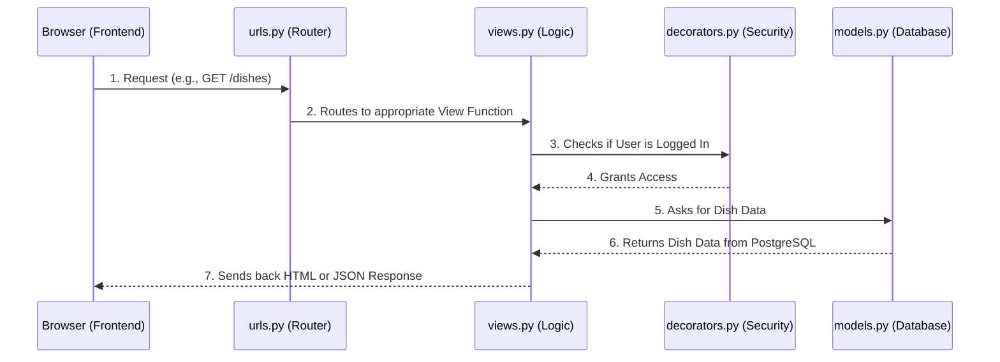
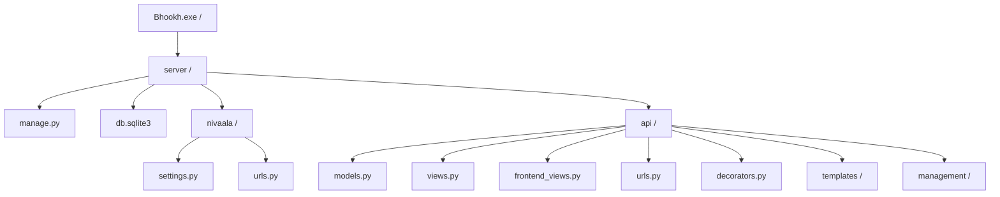

# NIVAALA Backend Architecture (Beginner's Guide)

Welcome to the backend of the NIVAALA app! The backend is the "brain" of the application. It handles the database, security, user authentication, and serving the frontend pages. 

We use **Django**, a high-level Python web framework, designed for rapid development and clean, pragmatic design.

---

## 🏗️ How the Backend Works (The "Why" and "How")

When you click a button or visit a URL in your browser, a **Request** is sent to the server. The Django backend processes this request, fetches data from the database, and sends back a **Response** (usually HTML to display on the screen, or JSON data).

Here is a visual representation of how a request travels through our backend:

---

## 📂 The File Structure Explained

Our backend is located entirely inside the `server/` directory. Inside `server/`, you will find the main project configuration (`nivaala/`) and our core application logic (`api/`).

### 1. The Root Server Folder (`server/`)
This is the base of the backend environment.
- **`manage.py`**: A built-in Django script. You use this file to run commands in the terminal. For example, `python manage.py runserver` starts the app, and `python manage.py makemigrations` updates the database.
- **`db.sqlite3`**: This is your local development database file where all users, dishes, and reviews are temporarily stored.

### 2. The Project Configuration (`server/nivaala/`)
This folder contains the master configuration for the entire server.
- **`settings.py`**: The control center. It defines database connections, security keys, installed apps, and timezone settings. If you want to change how the server runs globally, you do it here.
- **`urls.py`**: The master router. It takes the web address (like `nivaala.com/api/...`) and points it to the correct application folder (our `api` folder).

### 3. The Core Application (`server/api/`)
This is where 99% of our custom code lives. This folder dictates exactly how the app functions.

- **`models.py`** 📊
  - **What it is:** Defines the database structure using Python code. 
  - **Why it matters:** Instead of writing complex SQL queries, you create a Python class (e.g., `class Dish(models.Model):`). Django automatically converts this into a database table.

- **`views.py`** 🧠
  - **What it is:** The business logic for our APIs. 
  - **Why it matters:** When a user searches for a dish, the view function receives the search term, filters the `Dish` database model, and returns the results. 

- **`frontend_views.py`** 🖥️
  - **What it is:** The business logic for serving actual web pages.
  - **Why it matters:** While `views.py` handles API endpoints (like submitting a form), `frontend_views.py` is responsible for loading your HTML files (like `index.html`) and sending them to the browser.

- **`urls.py`** 🗺️
  - **What it is:** The local router map.
  - **Why it matters:** It connects specific URLs to specific functions in your `views.py` or `frontend_views.py`. For example, it tells Django that visiting `/dishes/5` should run the `dish_details_page` function.

- **`decorators.py`** 🛡️
  - **What it is:** Reusable security wrappers for our views.
  - **Why it matters:** We use a custom `@optional_auth` decorator to check the user's browser for a hidden "cookie" (JWT token). If it finds it, it knows who the user is. If not, it treats them as a "Guest Diner".

- **`templates/`** 🎨
  - **What it is:** Where all your `.html` frontend files live.
  - **Why it matters:** The backend `frontend_views.py` grabs files from this folder, injects dynamic data into them, and sends them to the user's screen.

- **`management/commands/seed_db.py`** 🌱
  - **What it is:** A custom script to populate the database with fake/test data.
  - **Why it matters:** When starting fresh, you run `python manage.py seed_db` to automatically create realistic restaurants, dishes, users, and reviews so you can test the app without typing it all in manually.
