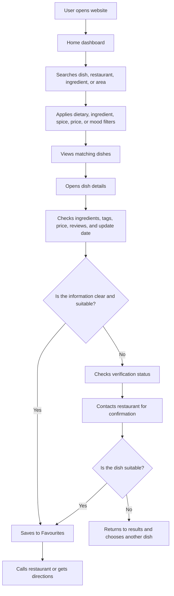
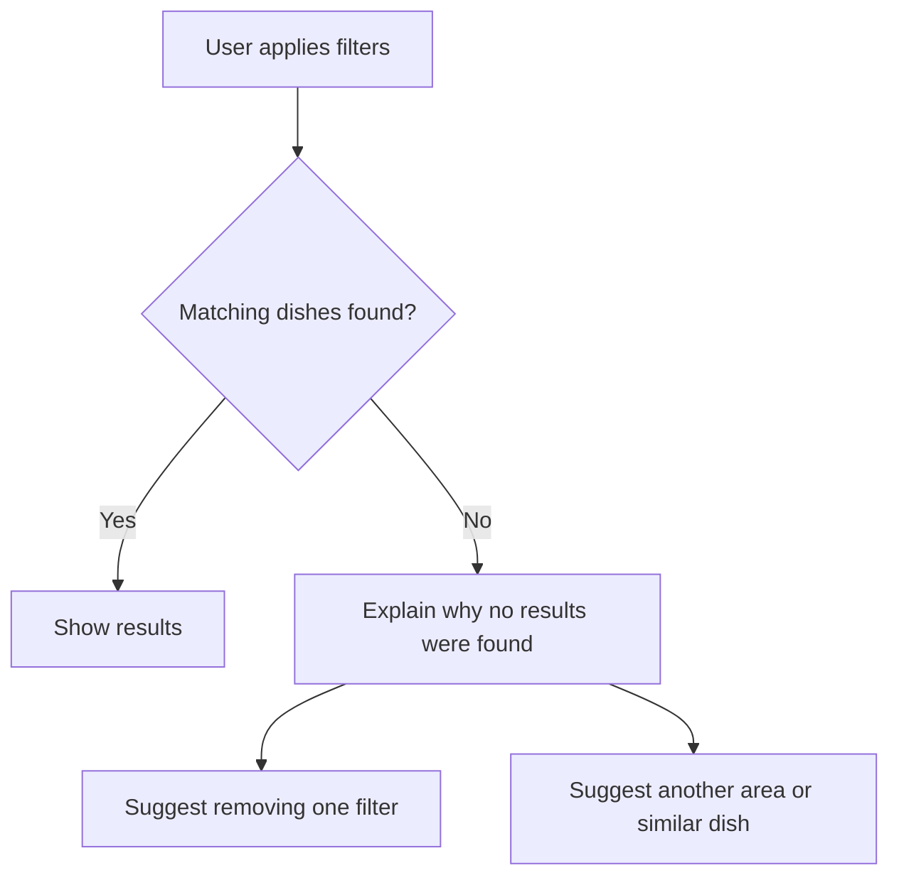
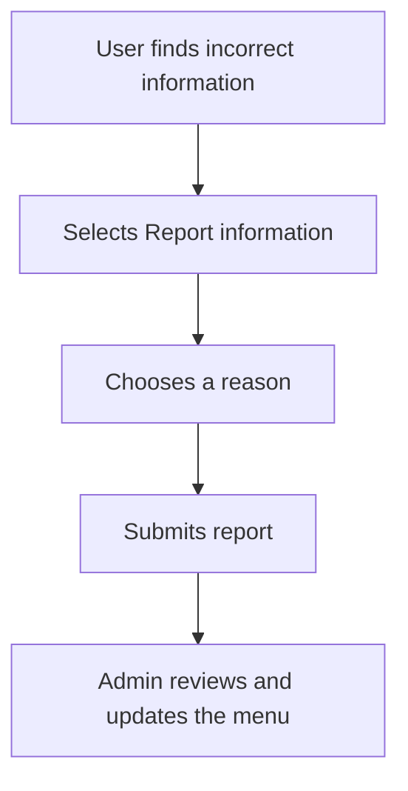
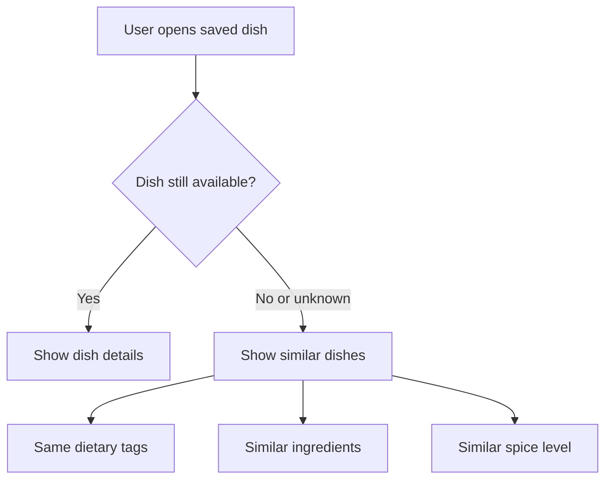

# MVP Ideation: Searchable Restaurant Menu Platform

## Product Idea

Build a simple searchable menu platform that helps diners find restaurant dishes based on:

- Ingredients.
- Ingredients to avoid.
- Dietary preferences.
- Spice level.
- Price.
- Location.
- Customer reviews.
- Mood or craving.

The main product promise is:

> Help diners find a suitable dish quickly and confidently.

---

## MVP Goal

The first version should solve one focused problem:

> “Help a diner find a dish that matches their food needs and taste, then save it or contact the restaurant.”

The MVP should not try to become a complete food-ordering, delivery, or restaurant-management platform.

---

## Target User

The primary user is a diner who wants to find suitable food without checking multiple menus or asking many questions.

Example user:

> I am vegetarian. I want something chatpata but not too spicy. I want to know the ingredients, price, and whether other customers liked it.

Other possible users include Jain diners, vegan diners, people avoiding allergens, health-conscious diners, and people searching according to a craving.

---

## MVP Mental Model

The user's natural thought process is:

```text
What do I want to eat?
        ↓
Can I eat this dish?
        ↓
What ingredients are in it?
        ↓
How spicy is it?
        ↓
Did other customers like it?
        ↓
Should I save it or contact the restaurant?
```

The product flow should follow this sequence instead of showing a complicated form at the beginning.

---

## MoSCoW Feature Scope

### Must-have

- Customer home dashboard.
- Search by dish, restaurant, ingredient, or area.
- Dietary filters such as vegetarian, vegan, Jain, eggless, dairy-free, and gluten-free.
- Include and exclude ingredient filters.
- Spice-level filter: no spice, mild, medium, spicy, and very spicy.
- Search results showing dish name, restaurant, price, tags, spice level, rating, and review count.
- Dish detail page.
- Ingredient list and ingredients to avoid.
- Dish-level customer reviews.
- Save to Favourites.
- Restaurant phone number and address.
- Verification status and last updated date.
- Clear allergy and health disclaimer.
- Simple admin data management through a spreadsheet or basic hidden page.

### Should-have

- Search by neighbourhood or location.
- Sort by best match, rating, price, or distance.
- “Can be customised” label.
- Review tags such as mild, good portion, tasty, and diet-friendly.
- Clear active filter chips.
- Result count and “Clear all” filters button.
- Helpful suggestions when there are no results.
- Report incorrect menu information.
- Mobile-friendly layout.

### Could-have

- Personal dietary profile.
- Hindi-English language toggle.
- Dish photos.
- Mood filters such as chatpata, light, crunchy, sweet, or comforting.
- Separate Favourite lists.
- Shareable dish links.
- Restaurant owner dashboard.
- QR code for restaurant menus.
- Verified-purchase reviews.

### Can ignore for now

- Online ordering.
- Online payments.
- Delivery tracking.
- Restaurant subscription plans.
- Full restaurant POS integration.
- Automatic ingredient detection from menu images.
- AI-generated allergy or health claims.
- Medical recommendations.
- Loyalty points.
- Live kitchen stock updates.

---

## Customer User Flow



Online information is the primary path. Calling the restaurant is a fallback for missing, uncertain, or high-risk information.

---

## Step-by-Step User Flow

### Step 1: Open the website

The user sees:

- A short product message.
- Search bar.
- Popular filters.
- Location option.
- Favourites option.

Example message:

> Find food that fits your taste and dietary needs.

### Step 2: Search

The user can search by:

- Dish name: Paneer tikka.
- Restaurant name: Spice House.
- Ingredient: Mushroom.
- Area: Koramangala.

For the 4-day MVP, keep search simple. Do not promise that the system understands complete sentences such as “mild vegetarian food.” Use separate filters for vegetarian and mild.

### Step 3: Apply filters

Example:

```text
Diet: Vegetarian
Avoid: Dairy
Spice: Mild
Price: Under ₹300
```

Show selected filters clearly:

```text
[Vegetarian ×] [Dairy-free ×] [Mild ×] [Under ₹300 ×]
```

Also show the result count and a “Clear all” button.

### Step 4: View results

Example result card:

```text
Mushroom Hakka Noodles
Green Bowl Café
₹220
Vegetarian · Dairy-free · Mild
★ 4.3 · 24 reviews

[View details] [♡]
```

### Step 5: Open dish details

Show:

- Dish name and price.
- Ingredients.
- Ingredients to avoid.
- Dietary tags.
- Spice level.
- Customisation options.
- Customer reviews.
- Restaurant confirmation status.
- Last updated date.
- Restaurant phone number and address.
- Save to Favourites button.

Example:

```text
Mushroom Hakka Noodles

₹220
Vegetarian · Dairy-free · Mild

Ingredients:
Noodles, mushroom, cabbage, carrot, soy sauce

Can customise:
Less spicy · No onion on request

★ 4.3 from 24 reviews

Restaurant-confirmed: Yes
Last updated: 21 September 2026

[Save to Favourites] [Call Restaurant]
```

### Step 6: Check reviews

Reviews should be connected to the dish, not only the restaurant.

Show:

- Overall rating.
- Spice feedback.
- Taste feedback.
- Portion feedback.
- Dietary accuracy feedback.
- Short customer comments.
- Review date and review count.

Avoid showing strong percentages when there are too few reviews.

### Step 7: Save to Favourites

The user selects the heart icon.

Show confirmation:

> Saved to Favourites.

For the MVP, one general Favourites list is enough. Separate lists can be added later.

### Step 8: Take action

The user can:

- Call the restaurant.
- Get directions.
- View the address.
- Share the dish.
- Return to results.

Online ordering is outside the first MVP.

---

## Important Alternative Flows

### No results



Example:

> No dishes match Vegetarian + Dairy-free + Mild. Try removing one filter or view similar dishes.

### Incorrect information



Possible reasons:

- Ingredient is incorrect.
- Price has changed.
- Spice level is incorrect.
- Dish is unavailable.
- Dietary tag is incorrect.

### Saved dish unavailable



---


## Criteria

The MVP should help a user:

1. Search for a dish or restaurant.
2. Apply dietary and spice filters.
3. Find at least one relevant dish.
4. Understand its ingredients and review information.
5. Save the dish or contact the restaurant.

Useful measurements include:

- Time taken to find the first suitable dish.
- Number of searches using dietary filters.
- Number of saved dishes.
- Number of users who open the restaurant contact option.
- Number of incorrect information reports.
- Whether users return to search again.

The most important success moment is:

> A user goes from “I need mild, dairy-free food” to “I found and saved a suitable dish” in less than a minute.

---

## Product Vision

> Make restaurant food discovery easier, clearer, and more personal for every diner.

Whether someone is vegetarian, Jain, allergic to a specific ingredient, following a health-related diet, or simply craving something chatpata, they should be able to find food that fits their needs and mood.
