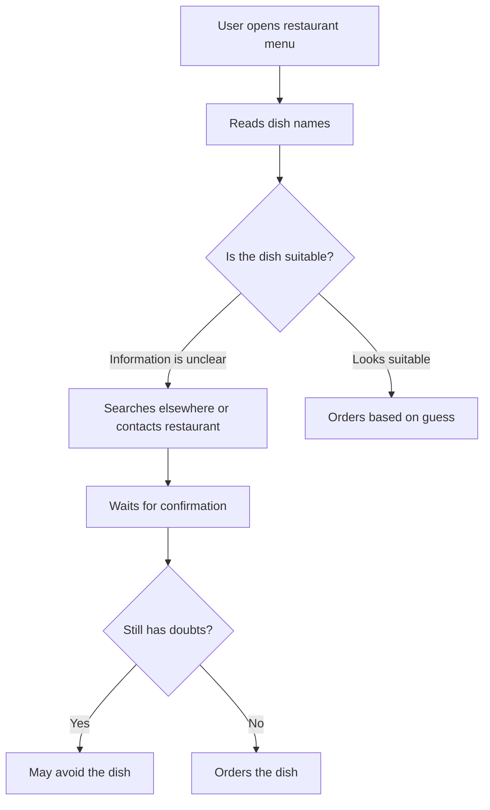

# Problem: Finding the Right Dish at a Restaurant

## The Problem in Simple Words

Finding food at a restaurant should be easy, but for many people it is not.

A menu may show only the dish name and price. It may not clearly explain:

- What ingredients are used.
- Whether the dish is vegetarian, vegan, Jain, or eggless.
- Whether it contains dairy, nuts, gluten, or other allergens.
- How spicy the dish actually is.
- Whether the restaurant can customise it.
- Whether other customers had a good experience with it.

Because of this, diners often ask many questions, make a guess, search several apps, or avoid the dish completely.

---

## My Personal Experience

I am a vegetarian, and I often find it difficult to locate a suitable dish at a restaurant.

Even when a menu has a vegetarian section, I may still not know:

- Which dishes are actually vegetarian.
- Whether the dish contains egg.
- Whether the gravy contains hidden non-vegetarian ingredients.
- Whether it can be made without onion or garlic.
- How spicy it will be.
- Whether the dish is worth the price and portion size.

I usually have to ask restaurant staff or search through different apps and reviews.

If this can be difficult for a vegetarian, it can be even more difficult for:

- Jain diners.
- People with food allergies.
- People avoiding dairy, gluten, nuts, or eggs.
- People with health-related food restrictions.
- People following a vegan or halal diet.
- People searching for food based on a mood or craving.

My personal experience is the starting point for this problem. It does not mean that every diner has exactly the same need, but it helps reveal a broader problem: restaurant menus often do not provide enough information for confident food choices.

---

## The Broader User Problem

Different diners search for food for different reasons.

### Dietary needs

A person may want:

- Vegetarian food.
- Vegan food.
- Jain food.
- Eggless food.
- Dairy-free food.
- Gluten-free food.
- Nut-free food.
- Low-sugar or low-oil food.

### Health-related needs

Some people may need to reduce or avoid:

- Very spicy food.
- Fried food.
- High-salt food.
- Dairy.
- Sugar.
- Specific ingredients recommended against by a doctor.

This product should not provide medical advice. It should only make menu information easier to find and understand.

### Mood and cravings

Sometimes a diner does not have a dietary restriction. They may simply want something specific:

- Chatpata.
- Spicy.
- Comfort food.
- Something light.
- Something crunchy.
- Something sweet.
- Something refreshing.
- Something filling.

For example:

> “Aaj mujhe kuch chatpata khana hai, but very spicy nahi.”

A useful menu experience should help users search by both what they can eat and what they feel like eating.

---

## Why Existing Menus Are Not Enough

Most restaurant menus provide basic information:

```text
Dish name + price
```

But diners often need:

```text
Dish name
+ ingredients
+ dietary tags
+ allergen information
+ spice level
+ customisation options
+ customer reviews
+ availability
```

A dish name alone does not answer the questions that matter to the diner.

---

## Current Experience



This process is slow, uncertain, and dependent on incomplete information.

---

## Main Pain Points

### 1. Ingredients are not clearly visible

A dish may contain ingredients that are not obvious from its name, such as egg, butter, cream, nuts, fish sauce, meat stock, onion, garlic, or a spicy sauce.

### 2. Dietary labels are incomplete

A vegetarian label may not answer whether the dish is eggless, Jain-friendly, dairy-free, or customisable.

### 3. Spice level is unclear

Words such as mild, medium, and spicy can mean different things to different people.

### 4. Reviews are not dish-specific

Restaurant-level ratings do not always tell a diner whether one particular dish was tasty, mild, suitable, or prepared according to a dietary request.

### 5. Information can become outdated

Restaurants may change ingredients, recipes, prices, preparation methods, or availability.

---

## Who Experiences This Problem?

| User type | Possible difficulty |
|---|---|
| Vegetarian diner | Finding dishes without meat, fish, or egg. |
| Jain diner | Avoiding onion, garlic, root vegetables, and other unsuitable ingredients. |
| Person with an allergy | Identifying possible allergens and confirming preparation details. |
| Vegan diner | Avoiding meat, dairy, eggs, and other animal-based ingredients. |
| Health-conscious diner | Finding lighter, less oily, low-sugar, or less spicy options. |
| Person with a craving | Finding chatpata, spicy, sweet, crunchy, or comforting dishes. |
| General diner | Comparing dishes using ingredients, price, spice, and reviews. |

---

## Problem Statement

Diners struggle to find restaurant dishes that match their dietary needs, ingredient preferences, spice tolerance, and current cravings because menu information is incomplete, inconsistent, and spread across different places.

As a result, they spend more time asking questions, searching online, making uncertain choices, or avoiding dishes they might have enjoyed.

---

## Why This Problem Matters

The problem is not only about finding vegetarian food. It is about making restaurant menus easier to understand for everyone.

A clearer menu experience can reduce:

- Repeated questions to restaurant staff.
- Guesswork before ordering.
- Time spent checking multiple apps.
- Fear of ordering the wrong dish.
- Disappointment after receiving unsuitable food.
- The need to avoid restaurants with unclear menus.

The goal is not to tell users what they should eat. The goal is to help them make a better-informed choice.

> Important: The platform should not promise that a dish is medically safe. People with serious allergies or health conditions should confirm directly with the restaurant.
