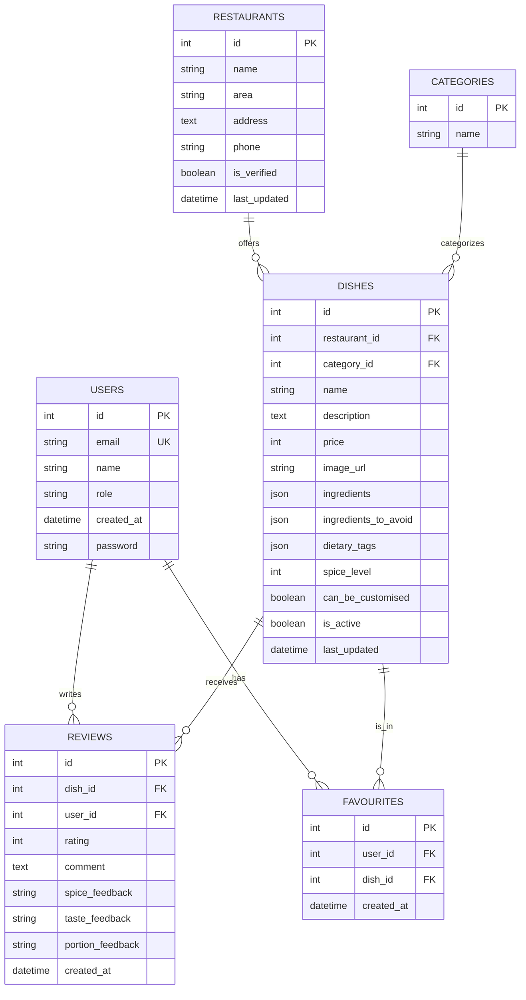

# Database Architecture & Analysis

### 1. Database Entity-Relationship Diagram

### 2. Business Rules & Database Protections

| App Rule | Protecting Database Rule |
| :--- | :--- |
| **"One user can only review a dish once"** | `UNIQUE CONSTRAINT` (`unique_dish_user_review` on `dish_id`, `user_id` in `Review` model). |
| **"One user can only favourite a dish once"** | `UNIQUE CONSTRAINT` (`unique_user_dish_favourite` on `user_id`, `dish_id` in `Favourite` model). |
| **"Email must be unique across all users"** | `UNIQUE CONSTRAINT` (`unique=True` on `User.email`). |
| **"Review rating must be between 1 and 5"** *(from API validation)* | **None currently.** *Suggestion: Add a `CHECK` constraint in the database (`CheckConstraint(check=Q(rating__gte=1) & Q(rating__lte=5))`).* |
| **"A cancelled booking must NOT block booking the same slot"** | **N/A** for this specific food app. But for the record, this would be solved using a **Partial Unique Index** (e.g., `UNIQUE(slot_id) WHERE status != 'cancelled'`). |

### 3. Endpoints & Required Indexes

| Endpoint | Columns Searched/Filtered/Sorted | Required Index |
| :--- | :--- | :--- |
| `GET /api/v1/dishes` | `name`, `description` (via `q`), `dietary_tags`, `ingredients`, `spice_level`, `price`, `restaurant.area` | B-Tree on `spice_level`, `price`. GIN index on `dietary_tags` and `ingredients`. (Django automatically indexes FKs like `restaurant_id`). |
| `GET /api/v1/dishes/{id}` | `id` | `PRIMARY KEY` (Auto-created) |
| `GET /api/v1/dishes/{id}/reviews` | `dish_id` | B-Tree on `dish_id` (Django creates this automatically for ForeignKeys). |
| `GET /api/v1/me/favourites` | `user_id` | B-Tree on `user_id` (Django creates this automatically for ForeignKeys). |

### 4. Schema Anti-Patterns Analysis

*Note: The floating-point money trap is successfully avoided (`price` is an integer in paise) and dates are correctly stored as `DateTimeField`, not text.*

| Problem | Why it matters | Fix |
| :--- | :--- | :--- |
| **Status/Role saved as free text** (`User.role`, `Review.spice_feedback`, etc.) | Anyone can insert invalid roles (e.g., `"admiin"`) or feedbacks (`"too hottt"`), breaking logic and filtering. | Use Django `TextChoices` and add database `CHECK` constraints to restrict allowed values. |
| **Missing `updated_at` / `created_at`** (`Category` missing both, `User` missing `updated_at`) | Hard to track when a category was added or when a user last updated their profile, making debugging/auditing difficult. | Add `created_at` (auto_now_add) and `updated_at` (auto_now) to all models for consistency. |
| **Missing Rating Bounds** | The API validates rating (1-5), but a script/shell could insert a rating of `999`, breaking frontend averages. | Add a database `CheckConstraint` on the `rating` field. |
