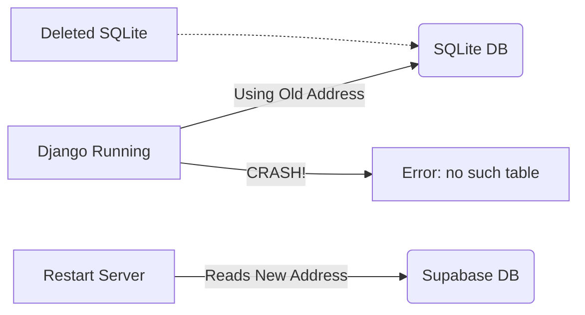

# The Oopsies & Bug Fixes (A Beginner's Guide)

Building an app is never a straight line. You will face errors, bugs, and crashes. This document explains the main issues we faced while building **Nivaala**, explained in simple terms and Hinglish analogies so you never forget them!

---

## 1. The "no such table: dishes" Error (Database Confusion)

**What happened:** 
Suddenly, the app crashed with a `500 Internal Server Error` saying it couldn't find the `dishes` table. 

**Why it happened:**
We had just migrated our data to a real, live database (Supabase PostgreSQL) and deleted the old, local testing database (`db.sqlite3`). However, our Django server had been running continuously in the terminal for over an hour. It hadn't realized that the `.env` file (which tells it where the database is) was updated. So, it kept trying to look for the deleted `db.sqlite3` file!

> 🧠 **Hinglish Analogy:** 
> Socho aapne purana ghar (SQLite) shift kar diya aur naya ghar (Supabase) bana liya. Par aapka dakiya (Django Server) abhi bhi purane ghar ke pate (address) par letters bhej raha hai kyunki usne apna map (environment variables) update nahi kiya! 

**How we fixed it:**
We stopped the server (`Ctrl+C`) and restarted it (`python manage.py runserver`). We also added `load_dotenv(override=True)` so it forcefully reads the new address every time it starts.

---

## 2. CSRF Verification Failed (The Bouncer Issue)

**What happened:** 
When we tried to click the "Logout" or "Save to Favourites" buttons, the server rejected the request with a `403 Forbidden` error.

**Why it happened:**
Django has an in-built security guard called CSRF (Cross-Site Request Forgery) protection to prevent hackers from making fake requests on your behalf. Because we were using HTMX to send requests instead of traditional HTML forms, Django didn't recognize our requests as safe.

> 🧠 **Hinglish Analogy:**
> Jaise kisi VIP party mein bina entry-pass ke bouncer andar nahi jaane deta. HTMX requests sahi the, par unke paas "Pass" (header) nahi tha, toh Django bouncer ne unhe bahar nikal diya.

**How we fixed it:**
We wrote a custom rule in our decorators. We told the bouncer: *"Agar request HTMX se aa rahi hai (matlab uske paas `HX-Request: true` ka tag hai), toh usko aane do, woh apna hi aadmi hai."*

---

## 3. UI Flow Issues (The Unclickable Doors)

**What happened:** 
In the Favourites list, the dish cards looked great, but clicking them didn't take you to the dish details page.

**Why it happened:**
The HTML was styled as an `<article>` (a block of text/design). Visually it looked like a button, but structurally, it was just text.

> 🧠 **Hinglish Analogy:**
> Yeh waisa hi tha jaise deewar pe darwaze ki painting bana di ho. Dikhne mein darwaza lag raha hai, par handle ghumaoge toh khulega thodi! Uske piche raasta (link) hona zaroori hai.

**How we fixed it:**
We wrapped the entire card in an Anchor tag (`<a href="/dishes/1">...</a>`). This magically turned the painting into a real door that navigates you to the details page.

---

## 4. Hardcoded vs Real Data (The Puppet Show)

**What happened:** 
Early on, no matter what we searched for, the same 3 dishes kept showing up on the screen.

**Why it happened:**
We were using "Mockups" (Static HTML). The data was literally typed into the code (`Mushroom Hakka Noodles`, etc.). It wasn't talking to any database.

> 🧠 **Hinglish Analogy:**
> Yeh ek puppet show tha. Kathputli (UI) hil rahi thi, par uske peeche asli insaan (Database) nahi tha. Humne jo likh diya, wahi dikh raha tha.

**How we fixed it:**
We connected the Django Views to the Supabase database. We replaced the hardcoded text with Django Template Tags (like `{{ dish.name }}`). Now, when the page loads, it fetches the actual, live data from the database.
