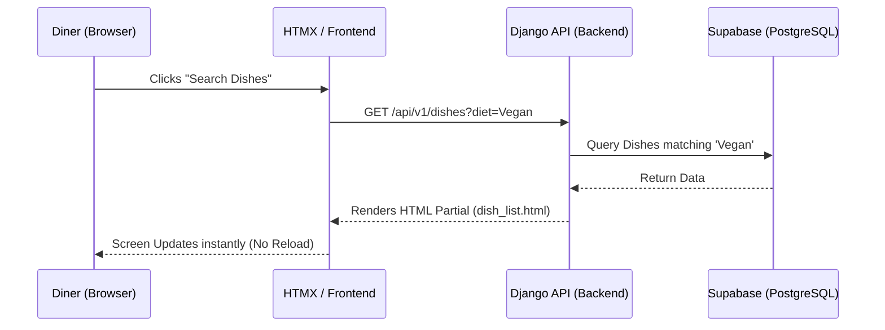

# Project Journey & Completion Report

Welcome to the **Nivaala** wrap-up report! This document gives a bird's-eye view of how we went from a simple idea to a fully functioning, production-ready Minimum Viable Product (MVP).

## 🚀 The Development Journey

Our goal was to build a platform that helps diners find dishes matching their exact dietary needs, without the noise. Here is how we built it step-by-step:

### Phase 1: Ideation & Static Mockups
We started with raw ideas (`MVP_ideation.md` and `features.md`). From there, we built beautiful static HTML screens (`html_skeleton/`) using Tailwind CSS. It looked great, but it was just a shell—nothing actually worked yet.

### Phase 2: The Django Engine (Backend)
To give the app a brain, we set up a **Django Backend**. 
- We mapped out our data models (Users, Restaurants, Dishes, Reviews, Favourites).
- We built secure APIs (`views.py`) that handle complex filtering (e.g., matching a "Dairy-free" diet with a "Mild" spice level).
- We implemented robust Authentication using JSON Web Tokens (JWT) stored in secure browser cookies.

### Phase 3: The HTMX Magic (Frontend)
Instead of building a heavy React frontend, we used **HTMX** and **Alpine.js**. This allowed us to inject dynamic behavior directly into our HTML templates (`server/api/templates/`).
- Users can click "Save to Favourites" and the heart icon updates instantly, without the page refreshing.
- The UI feels as fast and responsive as a mobile app.

### Phase 4: Going Live with Data
A local SQLite database is fine for testing, but we needed real power. We migrated the entire database to **Supabase (PostgreSQL)** in the cloud. We then seeded it with realistic menu data so the app felt alive.

### Phase 5: Security & UI/UX Polish
Finally, we audited the code. We secured endpoints against unauthorized access, fixed accessibility (WCAG) contrast issues, removed clunky developer tabs, and ensured the user flow strictly followed the S1 → S2 → S3 journey mapped out in our docs.

---

## 🏗️ Architecture Flow

Here is how the pieces of the puzzle communicate with each other when a diner uses the app:

## 🎉 Conclusion
The project is **100% complete** relative to the v1 MVP scope. It is secure, beautiful, fast, and ready to be deployed to the world!
